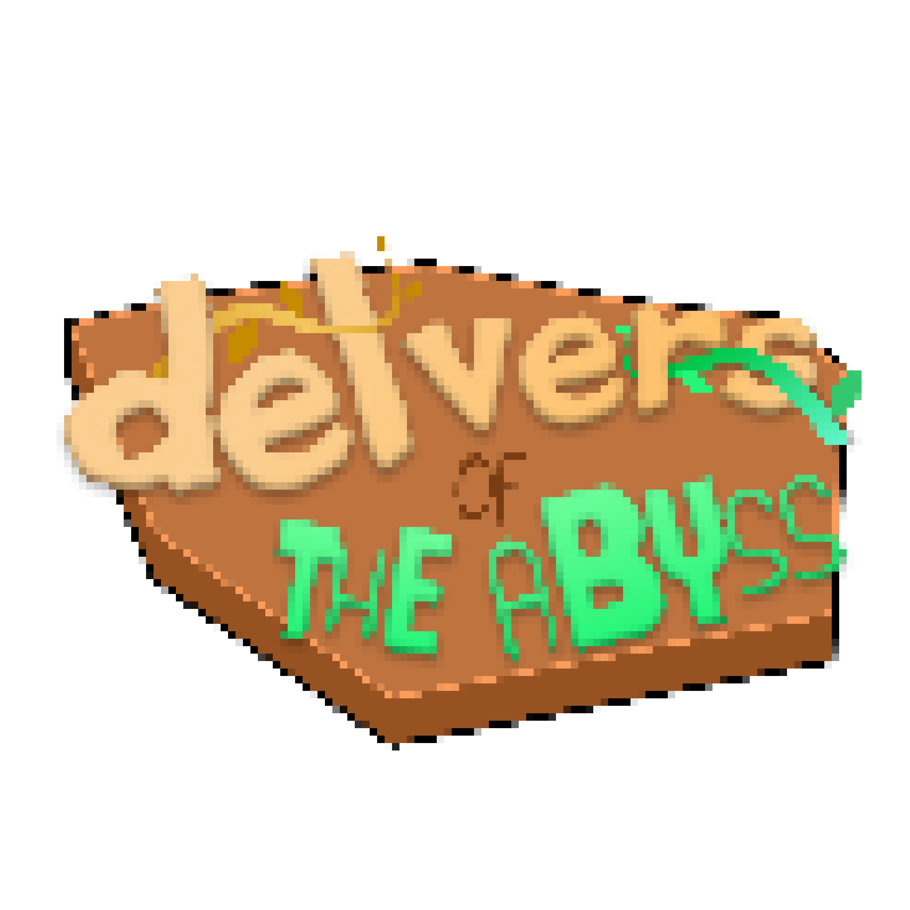

<p align="center">
  
</p>

<p align="center">
  <strong>A 2D exploration roguelite about descending into the Abyss, adapting with the environment, and surviving the climb back.</strong>
</p>

<p align="center">
  <a href="#english">English</a> · <a href="#bahasa-indonesia">Bahasa Indonesia</a>
</p>

---

<a id="english"></a>

# English

> **Status:** Post-jam playable prototype under continued development. Layer 1 is the current content focus; later layers remain incomplete.

## About

*Delvers of the Abyss* is a single-player 2D systemic exploration game with roguelite and extraction elements. Descend through an authored but variable Abyss, collect unusual relics, prepare a safe route, and outsmart creatures whose sight, hearing, movement, attacks, and status effects interact with the world. Reaching deeper areas is only half the expedition: limited health, inventory space, supplies, and the Ascension Curse make the climb back a challenge of its own.

The project began during **The Hack 2026 Game Jam by CCI** and continues as an open-ended passion project.

## Current build

The current run begins on the Surface and can be completed by reaching the Layer 2 gate. Implemented content includes:

- Surface preparation, shop, dialogue, and progression gate.
- Seeded selection from handcrafted Layer 1 section variations.
- Rope placement and climbing for planning descent and return routes.
- Five backpack slots, two hotbar slots, a physical whistle slot, item weight, and persistent world items.
- Relics designed as systemic tools rather than fixed puzzle keys.
- Layer 1 creatures using sight, sound, force, statuses, terrain, theft, and environmental reactions.
- Ascension Curse, save/continue, relic knowledge, economy, and debug/test tools.

Layer 1 maps still need their remaining variations, decoration, balancing, and bug cleanup. Layer 2 designs exist in the documentation but are not a finished playable layer.

## Controls

| Action | Input |
| --- | --- |
| Move | `A` / `D` or left/right arrows |
| Jump | `Space` |
| Climb Rope | `W` / `S` or up/down arrows |
| Interact / pick up | `E` |
| Primary item action | Left mouse button |
| Secondary item action / throw | Right mouse button |
| Select hotbar | `1` / `2` or mouse wheel |
| Inventory | `Tab` |
| Pause / close menu | `Esc` |
| Fullscreen | `F11` |
| Debug menu | `F3` |

Keyboard and mouse are currently supported. Controller support is planned but not promised yet.

## Download

- **Itch.io:** coming soon.
- Windows and Linux builds are supported. Packaged releases will be distributed through itch.io; selected older builds may later be archived under GitHub Releases.

Exact minimum hardware requirements have not been established. Development includes testing on a low-end four-core VM.

## Run from source

1. Install [Godot 4.7.1](https://godotengine.org/).
2. Clone this repository.
3. Import `project.godot` in Godot.
4. Run the project with `F6`/`F5`, or from a shell:

   ```bash
   Godot --path .
   ```

Useful smoke checks:

```bash
Godot --headless --path . --scene res://tests/foundation_smoke.tscn
Godot --headless --path . --scene res://tests/content_smoke.tscn
```

Read the [documentation index](docs/README.md), [programming guide](docs/panduan_programming.md), and [technical foundation](docs/fondasi_teknis_godot.md) before changing gameplay systems.

## Design documents

- [Editable GDD — English](docs/gdd_en.md)
- [Editable GDD — Bahasa Indonesia](docs/gdd_id.md)
- [Formatted GDD PDF — English](docs/delvers_of_the_abyss_gdd_en.pdf)
- [Formatted GDD PDF — Bahasa Indonesia](docs/delvers_of_the_abyss_gdd_id.pdf)
- [Current technical foundation](docs/fondasi_teknis_godot.md)
- [Live implementation contracts](docs/implementation/)

## Inspirations

The project is an original setting strongly inspired by *Made in Abyss* for descent, atmosphere, and progression; *Rain World* for ecology and mood; *Spelunky* for intentional authored variation; *Risk of Rain 2* for loot and run progression; and *Noita* and *Terraria* for systemic experimentation and interacting tools.

Current whistle-rank and Ascension Curse terminology is provisional and will be redesigned into original lore before a release-ready version.

## Credits

### Team and contributors

<!-- TODO(owner): Add every contributor's preferred public name and role. -->

- Project owner / design / programming: **TBD**
- Programming: **TBD**
- Game and enemy design: **TBD**
- Art and animation: **TBD**
- Audio: **TBD**
- Writing and localization: **TBD**
- Level design and testing: **TBD**

### Third-party assets

<!-- TODO(owner): Add each asset, creator, source URL, license, and required attribution before public release. -->

Some current assets are temporary, third-party, or AI-generated and are candidates for replacement. Do not assume that repository access grants permission to reuse any asset.

## Contributions and support

This repository is public for viewing only. Unsolicited pull requests are not currently accepted, and no public support or bug-report channel has been established.

## License

No reuse license has been granted. **All rights reserved** unless a file's own third-party license states otherwise. Source code, original assets, and third-party assets may have different owners; do not redistribute or reuse them without the relevant owner's permission.

---

<a id="bahasa-indonesia"></a>

# Bahasa Indonesia

> **Status:** Prototipe pasca-game-jam yang dapat dimainkan dan masih dikembangkan. Fokus konten saat ini adalah Layer 1; layer berikutnya belum selesai.

## Tentang game

*Delvers of the Abyss* adalah game eksplorasi sistemik 2D single-player dengan elemen roguelite dan extraction. Turunlah ke Abyss yang tersusun dari bagian buatan tangan tetapi dapat berubah setiap run, temukan relic aneh, siapkan jalur pulang, dan akali makhluk yang penglihatan, pendengaran, pergerakan, serangan, serta status effect-nya saling berinteraksi dengan dunia. Mencapai tempat yang lebih dalam baru separuh perjalanan: health, ruang inventory, supplies, dan Ascension Curse yang terbatas membuat perjalanan naik menjadi tantangan tersendiri.

Project ini berawal dari **The Hack 2026 Game Jam oleh CCI** dan dilanjutkan sebagai passion project tanpa batas akhir yang kaku.

## Build saat ini

Run saat ini dimulai di Surface dan dapat diselesaikan dengan mencapai gerbang Layer 2. Konten yang sudah tersedia meliputi:

- Persiapan di Surface, shop, dialogue, dan gerbang progression.
- Pemilihan section variation Layer 1 buatan tangan berdasarkan seed.
- Penempatan dan pemanjatan Rope untuk merencanakan jalur turun dan pulang.
- Lima slot backpack, dua slot hotbar, satu slot whistle fisik, item weight, dan world item persisten.
- Relic sebagai alat sistemik, bukan kunci untuk satu puzzle tertentu.
- Makhluk Layer 1 yang menggunakan sight, sound, force, status, terrain, pencurian, dan reaksi lingkungan.
- Ascension Curse, save/continue, relic knowledge, economy, serta tool debug dan testing.

Layer 1 masih memerlukan section variation yang tersisa, dekorasi, balancing, dan perbaikan bug. Desain Layer 2 sudah tersedia di dokumentasi, tetapi belum menjadi layer yang selesai dimainkan.

## Kontrol

| Aksi | Input |
| --- | --- |
| Bergerak | `A` / `D` atau panah kiri/kanan |
| Lompat | `Space` |
| Memanjat Rope | `W` / `S` atau panah atas/bawah |
| Interaksi / mengambil item | `E` |
| Aksi utama item | Tombol kiri mouse |
| Aksi kedua item / melempar | Tombol kanan mouse |
| Memilih hotbar | `1` / `2` atau roda mouse |
| Inventory | `Tab` |
| Pause / menutup menu | `Esc` |
| Fullscreen | `F11` |
| Menu debug | `F3` |

Keyboard dan mouse sudah didukung. Dukungan controller direncanakan, tetapi belum dijanjikan.

## Download

- **Itch.io:** segera tersedia.
- Build Windows dan Linux didukung. Packaged release akan dibagikan melalui itch.io; beberapa build lama mungkin akan diarsipkan melalui GitHub Releases.

Spesifikasi hardware minimum belum ditetapkan. Development juga diuji pada VM low-end dengan empat core.

## Menjalankan dari source

1. Install [Godot 4.7.1](https://godotengine.org/).
2. Clone repository ini.
3. Import `project.godot` melalui Godot.
4. Jalankan project dengan `F6`/`F5`, atau dari shell:

   ```bash
   Godot --path .
   ```

Smoke check yang berguna:

```bash
Godot --headless --path . --scene res://tests/foundation_smoke.tscn
Godot --headless --path . --scene res://tests/content_smoke.tscn
```

Baca [indeks dokumentasi](docs/README.md), [panduan programming](docs/panduan_programming.md), dan [fondasi teknis](docs/fondasi_teknis_godot.md) sebelum mengubah sistem gameplay.

## Dokumen desain

- [GDD editable — English](docs/gdd_en.md)
- [GDD editable — Bahasa Indonesia](docs/gdd_id.md)
- [GDD PDF terformat — English](docs/delvers_of_the_abyss_gdd_en.pdf)
- [GDD PDF terformat — Bahasa Indonesia](docs/delvers_of_the_abyss_gdd_id.pdf)
- [Fondasi teknis aktif](docs/fondasi_teknis_godot.md)
- [Kontrak implementation aktif](docs/implementation/)

## Inspirasi

Project ini adalah setting original yang banyak terinspirasi oleh *Made in Abyss* untuk perjalanan turun, atmosfer, dan progression; *Rain World* untuk ekologi dan suasana; *Spelunky* untuk variasi authored yang tetap terarah; *Risk of Rain 2* untuk loot dan run progression; serta *Noita* dan *Terraria* untuk eksperimen sistemik dan alat yang saling berinteraksi.

Istilah whistle rank dan Ascension Curse saat ini masih provisional dan akan diubah menjadi lore original sebelum versi yang siap rilis.

## Kredit

### Tim dan kontributor

<!-- TODO(owner): Tambahkan nama publik dan peran yang disetujui setiap kontributor. -->

- Pemilik project / desain / programming: **TBD**
- Programming: **TBD**
- Desain game dan enemy: **TBD**
- Art dan animation: **TBD**
- Audio: **TBD**
- Writing dan localization: **TBD**
- Level design dan testing: **TBD**

### Asset pihak ketiga

<!-- TODO(owner): Tambahkan setiap asset, pembuat, URL sumber, lisensi, dan atribusi wajib sebelum rilis publik. -->

Sebagian asset saat ini bersifat sementara, berasal dari pihak ketiga, atau dibuat dengan AI dan mungkin akan diganti. Akses ke repository tidak berarti asset tersebut boleh digunakan ulang.

## Kontribusi dan bantuan

Repository ini dibuka hanya untuk dilihat. Pull request yang tidak diminta belum diterima, dan belum ada jalur publik untuk support atau laporan bug.

## Lisensi

Belum ada izin penggunaan ulang yang diberikan. **Seluruh hak dilindungi** kecuali file dengan lisensi pihak ketiga menyatakan hal berbeda. Source code, asset original, dan asset pihak ketiga dapat dimiliki pihak berbeda; jangan mendistribusikan atau menggunakannya ulang tanpa izin pemilik terkait.
