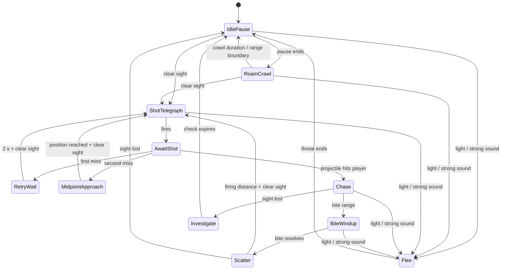

# Cave Spider — Final Behaviour Design Specification

**Status:** design handoff for implementation and tuning.  
**Scope:** replaces the Cave Spider's current continuous idle movement and simple shoot/cooldown loop.  
**Role:** a small ranged status enemy whose first successful projectile creates an escalating close-range problem and makes the Large Flyer a layer-wide threat.

## 1. Player-facing intent

The Cave Spider should feel like a creature moving over real cave geometry rather than a ground-bound turret or a continuously steering chaser.

While unalerted, it pauses, makes brief skittering crawls, then pauses again. It can use connected floors, walls, and ceilings.

When it spots the player, it stops and commits to a readable shot. A missed shot makes it briefly hold its position and try again. Repeated misses make it reposition to a closer, locked midpoint rather than continuously chasing the player. A successful projectile is the escalation: it makes the spider visibly pursue for one poisonous melee bite, then retreat to firing distance and resume ranged pressure.

Player damage interrupts this plan. The spider scatters to a firing position instead of stubbornly completing a shot or bite.

The player should be able to understand each outcome:

| Event | Spider response | Player meaning |
|---|---|---|
| Spider idling | Stop-and-go surface crawl | A local creature is searching its cave patch. |
| Spider sees player | Stops, warns, shoots | Break sight, move, or use a counter before the shot. |
| First shot misses | Holds still, retries after 2 s | The spider is committed but has not gained ground. |
| Second consecutive shot misses | Crawls to a locked midpoint, then shoots | The spider adjusts position without becoming a homing chaser. |
| Projectile hits | Warned surface chase, then one poisoned bite | The first hit has created an immediate close-range problem. |
| Player damages spider | Scatter to firing distance | Interrupting the spider creates space and breaks its current attack. |
| Sight breaks during chase | Checks last-known position for 3 s, then resumes roaming | Hiding/terrain genuinely breaks pursuit. |
| Light or priority-8+ sound | Flees and cancels active attack | World tools provide reliable counterplay. |

## 2. Non-negotiable movement rules

- The spider remains attached to and traverses **connected** cave geometry: floor → wall → ceiling and the reverse.
- It does not fly, teleport, or path through open air to reach a ceiling. Reaching another surface requires a connected physical route.
- Surface traversal continues to use the existing support probe, forward probe, normal transition, adhesion, and detach-grace system.
- AI chooses a direction, a locked destination, or a distance relationship. The surface-movement component decides how to follow the actual geometry.
- No state may calculate a fresh arbitrary destination every physics frame. This is the source of the current erratic feel.
- Attack damage exists only during the resolved projectile or bite attack window. There is no contact damage while crawling or chasing.

## 3. State model

The state names below are conceptual. They may be represented by a compact enum plus small sub-state fields, provided transitions remain equivalent and readable.



An accepted **player** hit may enter `Scatter` from any combat state (`ShotTelegraph`, `AwaitShot`, `RetryWait`, `MidpointApproach`, `Chase`, or `BiteWindup`). It cancels active attack timers and clears the active projectile-result wait. It must not allow a shot or bite to resolve after interruption.

## 4. Idle roaming

### 4.1 `IdlePause`

The spawn state and normal resting state.

- The spider remains still and plays its idle visual.
- Wait for `idle_pause_seconds`, selected randomly from exported minimum and maximum values.
- It still responds immediately to sight, light, and high-priority sound.
- When the wait ends, choose one of the two directions along the current support surface and enter `RoamCrawl`.

### 4.2 `RoamCrawl`

- Choose a surface travel sign (`-1` or `+1`) once at crawl start and retain it for the entire burst.
- Crawl for `roam_crawl_seconds`, selected randomly from exported minimum and maximum values.
- Recommended initial range: **0.6–1.4 seconds**.
- At the end of that time, stop and enter `IdlePause`.
- The crawl direction is permitted to carry the spider across connected walls and ceilings. It must not recalculate a player-like point target during this state.

### 4.3 Origin leash

`roam_distance` remains the simple designer-facing territory control. No authored patrol region, spline, marker chain, or custom placement workflow is required.

- The spider's authored spawn position is `_origin`.
- While inside `roam_distance`, normal crawl direction is random.
- If a crawl takes the spider outside `roam_distance`, it stops immediately and enters `IdlePause`.
- Its next crawl becomes a **return crawl**. Choose the current surface direction that most reduces distance to `_origin`.
- Continue using return crawls until the spider is inside `roam_distance - roam_return_buffer`.
- Recommended initial `roam_return_buffer`: **16–24 px**. This prevents boundary jitter.
- If the two directions are equally unsuitable because of local geometry, retain the safest current direction for one short crawl, then reassess after the next pause. Never loop indefinitely attempting to choose a perfect return direction.

## 5. Detection and initial shot

### 5.1 Target acquisition

- `SightSensor` remains the authority for ordinary player acquisition and line of sight.
- Normal sight scans remain every **0.5 s** and use the configured sight range (currently **150 px**).
- On a valid `target_seen` event, store the player as the active target and update `last_known_player_position`.
- While clear sight continues, refresh `last_known_player_position` from the visible player.
- Hushcap and terrain that block sight prevent a new shot setup.

### 5.2 Initial response

On first clear player detection from `IdlePause` or `RoamCrawl`:

1. Stop moving immediately.
2. Cancel the current idle/crawl timer.
3. Capture the player position as `shot_aim_position`.
4. Enter `ShotTelegraph`.

The spider does **not** approach before its first shot. Although `attack_range` may remain 240 px for balancing and non-sight cases, ordinary sight range is the practical gate for this first attack.

### 5.3 `ShotTelegraph`

- Remain stationary for adjustable `telegraph_seconds` (current starting value: **0.7 s**).
- Play the shoot animation and call `player.warn_attack(self, telegraph_seconds)`.
- Keep the captured `shot_aim_position`; do not turn the projectile into a homing attack.
- At timer completion, create exactly one temporary projectile and enter `AwaitShot`.
- If sight is lost before the projectile fires, cancel the telegraph and enter `Investigate` using the stored last-known position.
- Nearby active light, priority-8-or-higher sound, player damage, stun, or another supported interruption cancels the telegraph immediately.

## 6. Projectile-result loop

The projectile must report its terminal result to the source spider. Firing alone is not enough to choose the next state.

### 6.1 Required projectile outcomes

The generic projectile should notify its source once, using an explicit result rather than inference from timer expiry:

| Result | Meaning for Cave Spider |
|---|---|
| `hit_player` | A valid impact was applied to the player. |
| `hit_other_actor` | The projectile used its hit and did not hit the player. Treat as a miss for the spider's loop. |
| `hit_terrain` | Blocked shot; treat as a miss. |
| `expired` | Projectile lifetime ended without hitting the player; treat as a miss. |
| `cancelled` | Projectile was removed by a supported system. Treat as a miss unless the removal contract later says otherwise. |

Only the projectile owns collision and `ImpactData` application. The spider consumes the result; it must not duplicate projectile collision logic.

### 6.2 `AwaitShot`

- The spider remains still while its fired projectile is unresolved.
- Maintain the active target only while sight remains clear; on sight loss, enter `Investigate` with the last-known position.
- A projectile result resets no counters until it is classified below.

### 6.3 Projectile hit

On `hit_player`:

- Reset `consecutive_miss_count` to zero.
- Enter `Chase` immediately.
- The projectile itself retains its existing payload: adjustable damage plus Spider Slow, Poison, and Tracking Mark.

### 6.4 First consecutive miss

On the first miss:

- Set `consecutive_miss_count = 1`.
- Remain in the exact current position; do not drift, roam, or approach.
- Enter `RetryWait` for adjustable `miss_retry_cooldown_seconds` (starting value: **2.0 s**).
- When it expires, begin a fresh `ShotTelegraph` only if clear sight is still available. Otherwise investigate last-known position.

### 6.5 Second consecutive miss

On the second miss without a player hit between the shots:

- Set `consecutive_miss_count = 2`.
- Capture one immutable `midpoint_destination`:

```gdscript
midpoint_destination = global_position.lerp(player.global_position, 0.5)
```

- Enter `MidpointApproach`.
- The midpoint is **locked when this decision is made**. It does not follow player movement.
- Surface movement uses this locked world point only as a directional goal and follows connected cave geometry normally.
- On reaching the destination tolerance, stop and begin a fresh `ShotTelegraph` if the player is visible. If not, investigate.
- Reset `consecutive_miss_count` after this reposition shot is fired, or earlier if the player is lost and the combat loop ends. Do not accumulate misses indefinitely.

### 6.6 `MidpointApproach`

- Move toward only `midpoint_destination`; never overwrite it from the live player position.
- If the point is not exactly reachable due to cave geometry, use an adjustable arrival tolerance and a finite approach timeout. On timeout, stop at the closest reached position and either shoot if sight is clear or investigate if it is not.
- Light, strong sound, player damage, or stun interrupts this state.

## 7. Successful-hit escalation: chase and bite

### 7.1 `Chase`

On a successful projectile hit, the spider pursues the **live** player position over connected surfaces.

- The chase deals no contact damage by itself.
- The spider uses the same player warning signal as a telegraphed attack for its entire pursuit. Since `warn_attack` has a finite duration, refresh the warning at a short, configurable interval while `Chase` remains active.
- Keep updating `last_known_player_position` while sight is clear.
- When within adjustable `melee_range`, stop and enter `BiteWindup`.
- If sight breaks, stop chasing and enter `Investigate`.
- Light, strong sound, player damage, or stun interrupts the chase immediately.

### 7.2 `BiteWindup`

- Stop movement.
- Capture a bite aim/position at wind-up start so the bite is avoidable rather than silently tracking.
- Call `player.warn_attack(self, bite_windup_seconds)` and play a clear bite/lunge wind-up.
- `bite_windup_seconds` is adjustable. Recommended first test range: **0.3–0.5 s**.
- On timer completion, enable a distinct bite hitbox for the resolution window only. It must not be enabled during chase or wind-up.
- A successful bite applies adjustable melee damage and Poison through `ImpactData`/the shared effect system.
- After the bite resolves—whether it hits or misses—enter `Scatter`.

## 8. `Scatter`: retreat to firing position

`Scatter` is the combat retreat state. It is triggered by:

- an accepted player hit on the spider;
- the resolution of the poisonous bite.

Its purpose is to restore ranged spacing, not return the spider to its spawn origin.

- Move away from the player along connected cave geometry until reaching the adjustable firing-distance band.
- Initial band: **110–140 px** from the player. This is inside normal 150 px sight range but leaves meaningful shooting space.
- Once inside the band with clear sight, stop and enter `ShotTelegraph`.
- The state must not use automatic contact damage or continuously overwrite a destination every frame.
- It should use a locked retreat intent/short surface-travel commitment, then reassess at a brief pause if the geometry or player motion prevents entering the band cleanly.
- If sight breaks during scatter, enter `Investigate` rather than firing through terrain.
- If light or strong sound appears, `Flee` has higher priority.

## 9. Lost sight: `Investigate`

This state applies specifically when the spider loses sight during `Chase`; it is also the safe resolution when a pending ranged action loses its target before firing.

1. Capture `last_known_player_position` at the final valid sight update.
2. Crawl toward that locked position using normal surface movement.
3. On arrival, remain there and check the area for adjustable `investigate_wait_seconds` (initial value: **3.0 s**).
4. If the player is seen again at any point, immediately stop and begin `ShotTelegraph`.
5. If the check ends without reacquiring the player, clear combat target data and resume `IdlePause`/`RoamCrawl` behavior.

The investigation point must not update after sight breaks. It is a real check of where the player was last observed, not tracking through walls.

## 10. Flee and interruption priority

The existing hard counters remain stronger than all combat states.

| Trigger | Required response |
|---|---|
| Visible/active light within configured radius | Clear player target, cancel current attack, flee away while threatened. |
| Accepted sound with priority ≥ 8 | Clear player target, cancel current attack, flee away from the sound source. |
| Accepted player damage | Cancel current attack and enter `Scatter`. |
| Electric stun / shared valid interruption | Cancel attack and follow the existing support interruption contract; do not resolve stale hitboxes. |

`Flee` must clear transient attack state: projectile-result wait, chase-warning refresh, bite hitbox, bite timer, midpoint approach, and any locked firing position. When the threat ends, return to idle roaming with no stale player target.

## 11. Tuning exports

All balance-sensitive values belong in scene Inspector exports or the approved enemy data path; do not hide them as script constants.

| Export | Starting value / range | Purpose |
|---|---:|---|
| `move_speed` | 52 px/s | Base surface travel speed. |
| `roam_distance` | 90 px | Simple origin leash. |
| `idle_pause_min_seconds` / `idle_pause_max_seconds` | 1.0–2.5 s | Random stop duration. |
| `roam_crawl_min_seconds` / `roam_crawl_max_seconds` | 0.6–1.4 s | Short skitter duration. |
| `roam_return_buffer` | 16–24 px | Inward buffer before normal roaming resumes. |
| `attack_range` | 240 px | Attack rule; normal sight range remains the usual practical limit. |
| `telegraph_seconds` | 0.7 s | Ranged shot wind-up. |
| `miss_retry_cooldown_seconds` | 2.0 s | Hold-still delay after first miss. |
| `midpoint_arrival_tolerance` | 12–20 px | Acceptable distance to locked midpoint. |
| `midpoint_approach_timeout_seconds` | designer-tuned | Prevents geometry-induced permanent approach. |
| `melee_range` | designer-tuned | Chase distance that starts bite wind-up. |
| `bite_windup_seconds` | 0.3–0.5 s | Readable poisonous bite warning. |
| `bite_damage` | designer-tuned | Immediate melee damage. |
| `bite_poison_duration` | designer-tuned | Poison supplied by the bite. |
| `chase_warning_refresh_seconds` | designer-tuned | Keeps chase warning visible. |
| `firing_distance_min` / `firing_distance_max` | 110–140 px | Desired scatter/post-bite shooting band. |
| `investigate_wait_seconds` | 3.0 s | Time spent checking last-known location. |
| `projectile_speed` | 170 px/s | Temporary projectile speed. |
| `projectile_damage` | 3 default | Adjustable projectile base damage. |
| `adhesion_speed`, surface probe exports, normal-turn exports | existing | Preserve connected-surface movement tuning. |

## 12. Implementation ownership

| Location | Responsibility |
|---|---|
| `game/enemies/layer1/cave_spider.gd` | State transitions, idle timers, locked destinations, surface-motion requests, target memory, warnings, scatter/investigate behavior. |
| `game/enemies/layer1/cave_spider.tscn` | Sensors, probes, bite hitbox, collision layers, animations, Inspector tuning defaults. |
| `game/projectiles/projectile.gd` | Generic terminal-result callback/signal and shared `ImpactData` resolution. |
| `EnemySupport` | Damage, force, statuses, death, stun/interruption, persistence. |
| Effect definitions | Poison rules, durations, stacking, ticking, and modifiers. |
| Large Flyer targeting | Interprets `tracking_mark`; Cave Spider only applies the effect. |

## 13. Acceptance checks

### Idle and surfaces

- [ ] A spider visibly stops between short crawl bursts.
- [ ] Crawl and pause durations vary within their exported ranges.
- [ ] A crawl direction remains stable for its full burst.
- [ ] A spider can traverse connected floor, wall, and ceiling geometry.
- [ ] It cannot cross open air just to reach another surface.
- [ ] Leaving `roam_distance` makes it stop; its next crawl returns inward.
- [ ] The return buffer prevents repeated edge reversals/jitter.

### Detection and shots

- [ ] A clear sight event immediately stops idle roaming and starts the ranged telegraph.
- [ ] The initial attack does not approach first.
- [ ] A telegraphed shot is stationary and uses a captured aim position.
- [ ] Hushcap/terrain blocks a new shot setup.
- [ ] A first projectile miss produces a stationary 2-second retry.
- [ ] A second consecutive miss captures one midpoint and does not update it as the player moves.
- [ ] The midpoint approach follows surfaces and stops before its next shot.

### Hit escalation and counterplay

- [ ] A projectile hit enters a visibly warned chase.
- [ ] Chasing creates no automatic contact damage.
- [ ] The bite has an adjustable warning and hitbox active only at resolution.
- [ ] A successful bite applies its configured damage and Poison through shared systems.
- [ ] After a bite, the spider scatters to the 110–140 px firing band before shooting again.
- [ ] An accepted player hit cancels telegraph, projectile-result wait, chase, or bite and enters scatter.
- [ ] Light and priority-8+ sound override all combat states and cancel stale attack state.

### Lost sight

- [ ] Losing sight during chase locks the final known position.
- [ ] The spider checks that position for 3 seconds.
- [ ] It resumes roaming if the player is not reacquired.
- [ ] It does not continue tracking a player through terrain after sight is lost.

## 14. Migration notes from the current script

The current script continuously enters `MOVE` whenever it is not attacking, moves toward a live target during its cooldown, and uses no pause/crawl cycle. Replace that behavior with explicit idle timers and committed movement intents.

The current `_fire()` clears the target and starts a generic cooldown without receiving projectile outcome information. Replace this with a one-shot result callback that drives `RetryWait`, `MidpointApproach`, or `Chase`.

The existing surface traversal (`_move_on_surface`, probes, normal rotation, adhesion, and detach handling) should be retained and used by every new movement state. The behavior change is in **when and why** the spider asks to move, not in replacing the adhesion system.
