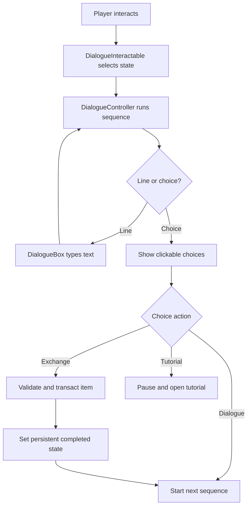

# Dialogue System Expansion — Programmer Handoff

**Status:** approved design handoff.  
**Scope:** extend the current linear dialogue viewer into a reusable NPC dialogue system with first/repeat interactions, configurable choices, one-time item exchange, tutorial opening, persistence, and hold-to-fast-forward.

## 1. Design goals

Adding ordinary dialogue should require no custom NPC code. A designer should be able to:

1. add one reusable dialogue-interaction child scene/component to a character;
2. drag `.tres` dialogue resources into Inspector fields;
3. set the character's first and repeat dialogue;
4. optionally add choices, an exchange, or a tutorial action through data.

The existing `DialogueBox` remains a presentation component. It must not decide inventory ownership, progression state, exchange completion, or tutorial rules.

## 2. Current system to preserve

The current resources and basic behavior remain valid:

- `DialogueLine` stores `speaker_id`, `speaker_name`, `text`, and optional `portrait`.
- `DialogueSequence` supports the legacy shared-speaker `lines` format and rich per-line `entries`.
- When `entries` is non-empty, it takes precedence over `speaker` and `lines`.
- Existing `prologue_intro`, `oldman_intro`, and `surface_intro` must continue to load and play without conversion.
- `DialogueBox.show_sequence(sequence, speaker, player)` remains a supported entry point for simple callers.
- Text types at the current configurable speed, uses the current typing blip behavior, and advances with the `interact` action.
- Dialogue locks player gameplay through the existing player lock system rather than stopping enemy/world simulation.

## 3. Recommended runtime ownership

### 3.1 `DialogueInteractable`

Create a reusable scene/script that can be added as a child of any character or world object. It owns interaction selection and persistent conversation state.

Suggested Inspector fields:

```text
persistent_id: StringName
first_sequence: DialogueSequence
repeat_sequence: DialogueSequence
completed_sequence: DialogueSequence (optional)
interaction_prompt: String
speaker_node: Node (optional)
player_reference: Node (optional; otherwise resolve through the approved player reference)
```

Basic setup should require only dragging the reusable child scene onto the NPC and dragging dialogue `.tres` files into these fields. No NPC-specific script is required for ordinary dialogue.

### 3.2 `DialogueController`

Create one runtime owner for an active conversation. It should:

- select the correct sequence from the interactable's state;
- pass the sequence to `DialogueBox`;
- evaluate conditions and choices;
- execute actions through game-system APIs;
- manage sequence transitions;
- report completion back to `DialogueInteractable`;
- open/suspend tutorial UI;
- close safely on Esc, death, or scene transition.

`DialogueBox` should emit input/results; it should not directly call Inventory, SaveManager, TutorialMenu, or NPC state methods.

## 4. Conversation state model

### 4.1 Ordinary NPC

For an NPC without an exchange:

```text
FIRST_INTERACTION → REPEAT_INTERACTION
```

- `first_sequence` is used until its sequence finishes.
- Completion is recorded only after the sequence reaches its end.
- Every later interaction uses `repeat_sequence`.
- If `repeat_sequence` is empty, the NPC may use `first_sequence` as a fallback or show no interaction; expose this behavior as a validated setup choice.

### 4.2 Exchange NPC

For the one NPC with an item exchange:

```text
FIRST_INTERACTION → REPEAT_BEFORE_EXCHANGE → EXCHANGE_COMPLETED
```

- `first_sequence` plays on the first completed interaction.
- `repeat_sequence` plays on all later interactions before the exchange succeeds.
- The exchange choice is available from the appropriate sequence.
- After a successful exchange, set the persistent exchange-completed flag.
- All future interactions use `completed_sequence`.
- The exchange is never repeatable, even if the player leaves and returns or reloads a save.

The same three-field structure can be used for ordinary NPCs; `completed_sequence` simply remains empty and no exchange flag is present.

### 4.3 Completion timing

The first-interaction flag and exchange-completed flag are committed only after the relevant sequence/action succeeds.

- Opening a sequence does not mark it complete.
- Closing with Esc, player death, or scene transition before the final step does not mark the first interaction complete.
- A successfully completed exchange changes the NPC's state immediately and permanently.

## 5. Dialogue data model

### 5.1 Backward-compatible sequences

Keep `DialogueSequence.lines` and `DialogueSequence.entries` for existing content. Add a richer data path for new conversations. A practical migration is:

```text
DialogueSequence
  legacy lines/entries (existing)
  steps: Array[DialogueStep] (new, optional)
  locks_gameplay
```

When `steps` is empty, the controller treats the existing lines/entries as a linear sequence. New sequences may use typed steps.

### 5.2 Typed steps

Each new step should be one of:

```text
LINE       speaker + text + portrait
CHOICE     one or more DialogueChoice entries
ACTION     one or more data-driven actions
END        explicit sequence completion (optional; reaching the final step also completes)
```

Do not require designers to write branching GDScript. A sequence resource should be editable from the Inspector and reusable by multiple interactables.

### 5.3 `DialogueChoice`

Suggested fields:

```text
choice_id: StringName
label: String
disabled_label/reason: String
conditions: Array[DialogueCondition]
actions: Array[DialogueAction]
next_sequence: DialogueSequence (optional)
```

The choice is always visible when authored, but conditions can disable it. Disabled choices do not execute actions and should explain why when the reason field is populated.

The number of choices is not hardcoded. The initial UI should support the current design of two choices while allowing the list to grow later (recommended UI capacity: four or more).

## 6. Choice UI and input

- Render each choice as a clickable button.
- Support mouse click, keyboard/controller navigation, and `interact` to confirm the focused choice.
- Keep the currently focused choice visually clear.
- Do not let a disabled choice execute or consume input as if it succeeded.
- A choice may start another sequence without destroying the dialogue controller.
- A choice may close the dialogue and open another UI, such as the tutorial menu.

For ordinary line advancement, retain the current `interact` action and `[E]` prompt. The prompt should change or be supplemented when choices are visible.

## 7. Item exchange

### 7.1 Data definition

Represent the exchange as data attached to the choice or interactable:

```text
required_item_id: StringName
required_quantity: int = 1
reward_item_id: StringName
reward_quantity: int = 1
success_sequence: DialogueSequence (optional)
failure_feedback: String (optional)
```

The current requested exchange is one-time and belongs to one NPC, but the data structure should be reusable for future exchanges.

### 7.2 Disabled state

The exchange choice remains visible but is disabled when the player lacks the required item. It must not silently disappear.

The disabled presentation should explain the missing requirement using the authored disabled label/reason or a generated item name.

### 7.3 Atomic exchange and full inventory behavior

The exchange action must use the existing inventory/ItemDefinition APIs. It must not edit inventory arrays directly.

Required flow:

1. Validate the required item and quantity.
2. Determine whether the reward can be placed in the player's inventory.
3. If inventory has space, prepare the reward grant.
4. If inventory is full, create a safe persistent world reward at the player's current location instead.
5. Confirm the reward grant or safe world spawn succeeded.
6. Consume the required item.
7. Set the NPC's persistent exchange-completed flag.
8. Play the success dialogue and switch the NPC to `completed_sequence`.

The player must never lose the required item because the reward could not be granted. If both inventory insertion and safe world spawning fail, the action fails with no consumption and no state change.

When the reward is dropped because inventory is full:

- use the real world-item/persistence path, not a temporary visual copy;
- place it at a validated safe point at or immediately beside the player;
- ensure it is not spawned inside terrain or an unreachable collision;
- preserve its item ID, quantity, and instance state;
- do not require the player to have an empty slot afterward.

The exchange should not partially consume or partially grant a stack unless the existing inventory transaction explicitly supports and validates that behavior.

### 7.4 Success transition

On a successful exchange:

- show the optional success sequence immediately;
- commit exchange completion before the next interaction can begin;
- use `completed_sequence` for every future interaction;
- remove or disable the exchange choice permanently;
- persist the state through save/load.

## 8. Tutorial option

A choice can execute an `open_tutorial` action with a tutorial ID or menu section.

Flow:

```text
select tutorial choice
  → finish/suspend current dialogue step
  → open the existing pause-screen TutorialMenu
  → pause the world
  → keep dialogue/player ownership consistent
  → return cleanly when tutorial closes
```

The tutorial option should not require a custom NPC script. A dialogue action supplies the tutorial ID/section.

Recommended behavior is to close the current dialogue sequence before opening the tutorial. If the design later needs return-to-dialogue, the controller can preserve a resumable sequence cursor, but this is not required for the first implementation.

## 9. Hold-to-fast-forward

Holding the existing `interact`/control action for one second changes dialogue behavior only while text is typing.

### 9.1 Required behavior

- A normal press retains current behavior: while typing, reveal the current line; otherwise advance.
- If the player holds the action continuously for `fast_forward_hold_seconds` (default **1.0 s**) while text is typing, immediately reveal the current line.
- While the action remains held, automatically continue advancing through subsequent lines at a configurable fast-forward cadence.
- Fast-forward stops when a choice menu appears, when the sequence ends, or when the action is released.
- Releasing and pressing again is required to confirm a choice or advance after a stopped fast-forward.
- Fast-forward does not operate while choices are visible.

Expose at least:

```text
fast_forward_hold_seconds = 1.0
fast_forward_line_delay (tunable)
```

Track press, hold, and release explicitly in `DialogueBox`/controller. The current `_input` implementation handles only pressed events and must be extended without allowing keyboard echo to create repeated advances.

### 9.2 Input safety

- Do not let the initial held press accidentally select a choice when fast-forward stops.
- Do not advance multiple lines from one ordinary key-repeat event.
- Do not fast-forward a tutorial menu or other UI opened by a dialogue action.
- Keep the current rule that dialogue input is ignored while the tree is paused unless the active dialogue/tutorial UI explicitly owns that input.

## 10. Closing and interruption

- Esc closes active dialogue according to the existing recommendation.
- Closing before the end does not mark first interaction complete.
- Closing does not consume exchange items or set exchange completion.
- Player death, scene transition, or invalid speaker cleanup closes the dialogue safely and releases the player dialogue lock.
- `DialogueBox.close()` remains idempotent: it must not double-unlock the player or emit completion incorrectly.
- `dialogue_finished` should mean the active sequence reached its end, not merely that the panel was hidden.

## 11. Persistence

Each `DialogueInteractable` requires a stable unique `persistent_id` when its state must survive saves.

Persist:

```text
first_interaction_completed
exchange_completed
any authored dialogue flags required by conditions/actions
```

Do not store mutable per-NPC state in shared `DialogueSequence` resources. Store it on the interactable instance or its persistence adapter.

Restore must be idempotent and must not replay first-time dialogue or grant an exchange reward again.

## 12. Conditions and actions

### 12.1 Initial conditions

Implement only the small set needed by current content, with an extensible data shape:

- has item/quantity;
- first interaction state;
- exchange completed state;
- persistent flag;
- tutorial seen/open state, if needed.

### 12.2 Initial actions

- consume item through inventory API;
- grant item through inventory API or safe world drop;
- set persistent flag;
- mark exchange complete;
- start another dialogue sequence;
- open tutorial menu.

Actions should return a success/failure result. The controller commits subsequent actions only when the preceding transaction contract permits it.

## 13. Suggested runtime flow



## 14. Implementation ownership

| File/system | Responsibility |
|---|---|
| `data/definitions/dialogue_line.gd` | Preserve per-line speaker/text/portrait data. |
| `data/definitions/dialogue_sequence.gd` | Preserve legacy lines/entries and add optional typed steps. |
| New `dialogue_choice.gd` / condition/action resources | Inspector-editable choices and data-driven logic. |
| New `dialogue_interactable.gd` and reusable child scene | NPC setup, first/repeat/completed sequence selection, interaction prompt, persistence state. |
| New `dialogue_controller.gd` | Runtime sequence execution, choice resolution, actions, transitions, completion. |
| `dialogue_box.gd` | Presentation, typing, button rendering, interact/hold input, warnings/results. |
| Inventory/item transaction APIs | Required-item validation, consume, reward grant, safe world drop. |
| Existing TutorialMenu/pause owner | Pause world and display tutorial content. |
| SaveManager/persistence adapter | Persist interactable flags and exchange completion. |

## 15. Acceptance checks

### Adding content

- [ ] A designer can add the reusable dialogue child to a character without writing NPC-specific code.
- [ ] Dialogue resources can be assigned by dragging `.tres` files into Inspector fields.
- [ ] Existing legacy `lines` and rich `entries` resources still play unchanged.
- [ ] An ordinary NPC supports first dialogue, then repeat dialogue forever.
- [ ] The exchange NPC supports first, repeat-before-exchange, and completed dialogue states.

### Choices

- [ ] Choices render as clickable buttons.
- [ ] Choices support keyboard/controller focus and confirmation.
- [ ] The number of choices is data-driven rather than fixed at two.
- [ ] Disabled choices remain visible and explain their unavailable condition.
- [ ] Choices can start another sequence without custom NPC code.

### Exchange

- [ ] The required item is checked through inventory APIs.
- [ ] Missing-item choice is disabled.
- [ ] A successful exchange consumes the required item exactly once.
- [ ] A reward is granted to inventory when possible.
- [ ] If inventory is full, the reward is safely dropped beside the player as a persistent real item.
- [ ] If reward delivery fails, no item is consumed and exchange state is unchanged.
- [ ] Successful exchange plays its success dialogue and permanently switches future dialogue.
- [ ] Reloading a save cannot repeat the exchange or grant another reward.

### Tutorial

- [ ] A dialogue choice opens the existing TutorialMenu.
- [ ] The world is paused while the tutorial is open.
- [ ] Dialogue and player locks are released/restored correctly when the tutorial closes.

### Fast-forward and interruption

- [ ] Holding interact for one second reveals the current typed line.
- [ ] Continued holding advances through later lines automatically.
- [ ] Fast-forward stops at choices and requires deliberate choice input.
- [ ] Fast-forward applies only during typing, not to choices or tutorials.
- [ ] Esc closes dialogue without falsely marking an unfinished first interaction complete.
- [ ] Death/scene exit releases dialogue locks safely.

### Persistence

- [ ] Stable interactable IDs restore first/repeat/completed states correctly.
- [ ] Dialogue sequences remain immutable shared resources; instance flags live on the NPC/interactable.
- [ ] Restore does not replay rewards or duplicate persistent world drops.
