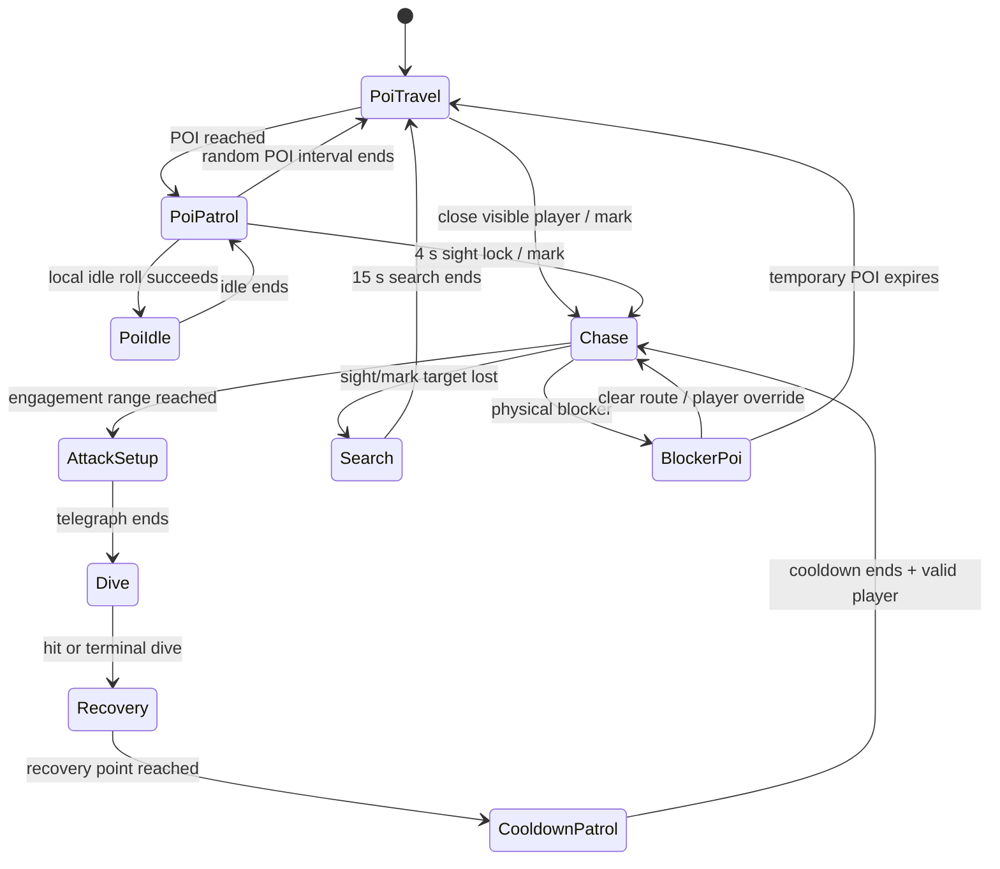

# Large Flyer — Final Behaviour Design Specification

> **Archived:** historical proposal. Current contract: [`../../implementation/layer_1_enemies.md`](../../implementation/layer_1_enemies.md).

**Status:** implementation and tuning handoff.
**Scope:** defines the final Layer 1 Large Flyer movement, player interaction, Tracking Mark, blocker response, and existing persistence/combat contracts.

## 1. Role and player-facing intent

The Large Flyer is the Layer 1 apex pressure: one persistent enemy whose presence makes open routes, noise, and status effects matter across the whole layer. It is not a per-room boss and must never duplicate on section changes.

Normal sight is threatening but fair. The player has four seconds of continuous visibility before the Flyer becomes interested and begins pursuit. A player who is already dangerously close has no such grace period. A Cave Spider's Tracking Mark is more serious: it continuously supplies the player's position and immediately starts a chase even through sight blockers, although the Flyer must still physically close before it may attack.

Away from the player, the Flyer should feel alive: it travels between authored POIs, circles each POI using a natural bird-like patrol, and sometimes hangs in the air before changing local destination.

## 2. Invariants

- Exactly one living Flyer exists for the run and travels across Layer 1 sections as the same persistent actor.
- Health, death state, and active persistent statuses survive section transfer and Layer 2 transfer.
- Targets, sight lock, search, temporary blocker POIs, dive state, cooldown state, and local patrol destinations are transient and reset on transfer.
- Ordinary slow and ordinary knockback do not affect the Flyer. Poison, distraction, Driftseed, Bolt Shock, and Silver Weight follow their existing shared-system contracts.
- Transparent authored blockers physically stop Flyer movement while not blocking sight.
- The Sky Hunter Flock avoids the Flyer; the Flyer does not target or react to the flock.
- All movement values and probabilities listed below are Inspector/data tuning values, not hidden script constants.

## 3. Core states



Sound and distraction requests may override ordinary POI movement, but they are investigations rather than attacks. Bolt Shock delegates flight-disabled movement to the shared support system and cancels committed movement/attack state safely.

## 4. POI route and local patrol

### 4.1 Selecting the next authored POI

The Flyer selects nodes in the `large_flyer_poi` group.

- It chooses POIs using **least recently used**, with nearest POI as the tie-breaker.
- Selection is deterministic; do not use random POI choice.
- The interval before selecting another authored POI is random between exported `poi_change_min_seconds` and `poi_change_max_seconds`.
- Default interval: **12–18 seconds**.
- Invalid/freed POIs are ignored. If none are valid, use the authored origin/section fallback.

### 4.2 Local patrol at a POI

Once the Flyer reaches its POI, it patrols around that POI using the Knockback Bird's natural patrol method. The POI acts as the patrol centre, replacing the bird's nest.

Use these default values, all adjustable:

| Setting | Default | Rule |
|---|---:|---|
| `poi_patrol_radius` | 160 px | Maximum patrol region around current POI. |
| `poi_inner_flight_radius` | 130 px | Preferred usable region, leaving turn room at the edge. |
| `local_destination_refresh_min/max` | 1.5–2.5 s | New local point when timer ends or destination is reached. |
| `local_destination_min/max_distance` | 50–120 px | Candidate distance from current Flyer position. |
| `local_direction_variance_degrees` | ±60° | Bias next point toward current travel direction. |
| `local_steering_strength` | 0.04 | Smoothly steer rather than snap direction. |
| `max_destination_attempts` | 10 | Finite candidate retry count. |
| `local_idle_chance` | 1 in 6 | Chance that a new local target becomes an idle instead. |
| `local_idle_min/max_seconds` | 1–2 s | Duration of a successful local idle roll. |

Each candidate must be inside the patrol region and have a clear path against the Flyer movement-blocker mask. The fallback sequence is: POI centre if valid, retain current valid point briefly, then hover/retry. Never use an infinite destination-generation loop.

When a new local destination is generated, roll the 1-in-6 idle chance. On success, the Flyer remains still for the selected 1–2 second duration, then generates/uses the next local destination. Player interaction, Tracking Mark, sound requests, and valid interrupts override this idle immediately.

## 5. Target-request priority

The existing request queue remains the source of truth for competing interests. Each request stores stable ID, source, target position/actor, base priority, timestamps, expiry, and whether it requires sight.

Priority remains:

```text
Tracking Mark > Lantern Snail scream > Rattlepod / Whistle / Lantern Crystal
              > ordinary player sight > authored POI roaming
```

- Requests decay at the exported `priority_decay_per_second` rate.
- Equal effective priority chooses the newest request.
- Invalid or expired requests are removed immediately and the next valid request is selected.
- Sound/distraction requests move the Flyer to their event position and do not trigger a player dive.
- Ordinary POI roaming is the fallback when no request remains.

## 6. Ordinary sight behavior

### 6.1 Continuous sight lock

An unmarked player must be continuously visible for `sight_lock_seconds` before normal pursuit begins.

- Default `sight_lock_seconds`: **4.0 seconds**.
- While the timer is below four seconds, the Flyer **ignores the player for movement purposes** and continues its existing POI travel/local patrol behavior.
- It still keeps testing sight each update. Broken sight resets the timer; disconnected glimpses never accumulate.
- If the player breaks sight before the lock completes, the Flyer does not search or chase. It simply resumes ordinary POI behavior.

### 6.2 Immediate close-range exception

If an ordinarily visible player is within `engagement_distance`, the Flyer skips the remaining sight lock and enters pursuit/attack behavior immediately.

- Default `engagement_distance`: **80 px** (2.5 × the current 32 px player height).
- The engagement distance is adjustable.

### 6.3 `Chase`

After the four-second lock (or the close-range exception), the Flyer follows the live player position at `chase_speed`.

- It updates the last-known player position only while the player is visible.
- Once within `engagement_distance`, it stops and enters `AttackSetup`.
- No damage is dealt while simply chasing.
- Physical blockers may divert this state into `BlockerPoi` as described below.

## 7. Tracking Mark behavior

Tracking Mark is a position-sensing override, not an ordinary sight bonus.

- While the player has the mark, the Flyer always knows the player's current position, even without direct sight.
- The mark does not add to or satisfy the four-second ordinary sight timer.
- Instead, a valid mark immediately creates/refreshes the highest-priority request and puts the Flyer in `Chase`.
- The Flyer must still physically reach `engagement_distance` before it can stop and begin an attack telegraph. Tracking does not permit an arbitrary long-range dive.
- If Tracking Mark expires while the Flyer has no ordinary sight of the player, clear the tracked target immediately and begin `Search` at the final tracked position.
- If sight is available when the mark ends, the Flyer falls back to the normal sight-lock rules; it does not inherit a completed four-second lock from Tracking Mark.

## 8. Attack, dive, and recovery

### 8.1 `AttackSetup`

At engagement distance:

1. Stop movement.
2. Capture the target position in `dive_aim_position`.
3. Call `player.warn_attack(self, telegraph_seconds)`.
4. Telegraph for adjustable `telegraph_seconds`.

Defaults retained from current behavior:

| Setting | Default |
|---|---:|
| `telegraph_seconds` | 0.9 s |
| `dive_speed` | 250 px/s |
| `dive_max_seconds` | 1.5 s |
| `attack_damage` | 75 |
| `attack_force` | 180 |
| `attack_hit_radius` | 28 px |

The dive aim is locked at telegraph start. The dive does not home or silently retarget. Its hit may resolve only once.

### 8.2 `Dive`

- Fly toward captured `dive_aim_position` at dive speed, modified only by supported flight effects.
- On the first valid player impact inside `attack_hit_radius`, apply the configured damage and force once, then recover.
- A dive that reaches its terminal duration/aim without impact deals no damage and still recovers.
- Valid interruption and Bolt Shock cancel the dive safely; no stale attack hit may remain active.

### 8.3 `Recovery`

After every dive, whether hit or miss:

- Generate one locked recovery destination using the Knockback Bird recovery approach.
- The destination is `engagement_distance` away from the player—default **80 px**—with a small adjustable angle variance.
- The away direction is from the player toward the Flyer’s current position, so recovery genuinely backs away rather than returning toward a nest.
- Validate the path with the Flyer movement-blocker mask; retry a finite number of candidates. Use a safe fallback if none are valid.
- Fly to that destination with normal smooth flight.

### 8.4 `CooldownPatrol`

On reaching the recovery destination, start/continue the existing adjustable attack cooldown (default **4.0 seconds**).

- During cooldown, locally patrol around the recovery point using the same bird-style candidate generation, steering, collision validation, and 1-in-6 idle behavior used at an authored POI.
- Player interaction can interrupt cooldown patrol: a stronger request supersedes it, while a valid player should be evaluated normally once the cooldown ends.
- After cooldown, a valid player request resumes `Chase`; if none remains, return to normal POI behavior.

The existing brief `recovery_seconds` remains adjustable with default **0.2 s** and may serve as the immediate post-dive pause before movement to the recovery destination.

## 9. Lost sight and `Search`

Search applies only after the Flyer has already begun chasing a player or is acting on Tracking Mark.

### 9.1 Ordinary chase loses sight

When sight breaks after active chase:

1. Lock the final `last_known_player_position`.
2. Fly toward that point.
3. On arrival, patrol locally around it using the normal bird-style local patrol rules.
4. Continue searching for adjustable `search_seconds` (default **15 seconds**) from the moment sight was lost.
5. If sight returns, return to `Chase` or immediate `AttackSetup` when already in engagement distance.
6. If the timer ends without reacquisition, clear player target data and resume authored POI roaming.

The Flyer must not track through terrain after ordinary sight is lost.

### 9.2 Tracking Mark ends without sight

When Tracking Mark expires and no ordinary sight remains, immediately use the same `Search` flow at the final tracked position, then return to POI roaming if the search fails.

## 10. Temporary blocker POI

Transparent authored blockers stop Flyer movement but do not obstruct sight. A direct chase can therefore be physically blocked while the player remains visible or tracked.

### 10.1 Creating `BlockerPoi`

Create a temporary blocker POI when all are true:

- the Flyer is in `Chase` or has a valid player sight/tracking request;
- `move_and_slide()`/collision data confirms physical contact with a configured Flyer movement blocker;
- `blocker_poi_cooldown_remaining` is zero.

Then:

1. Capture a temporary POI at the blocker contact position or an authored blocker reference point.
2. Set its lifetime to adjustable `blocker_poi_seconds` (default **15 s**).
3. Set the global blocker-POI creation cooldown to adjustable `blocker_poi_recreate_cooldown_seconds` (default **20 s**).
4. Patrol locally around the blocker with the same 160 px radius, candidate validation, and 1-in-6 idle rule as ordinary POIs.

### 10.2 Resolution

- A clear direct flight route to a valid player immediately overrides `BlockerPoi` and resumes `Chase`.
- Higher-priority player interaction also overrides it.
- The temporary POI expires after 15 seconds.
- It cannot create another blocker POI until the full 20-second creation cooldown expires, even if it collides with a blocker again.
- On expiry with no player override, resume normal request selection/POI roaming.

This behavior prevents the Flyer from endlessly pressing into a transparent blocker while preserving the player’s ability to use terrain to change the encounter.

## 11. Movement blockers and patrol validation

- The Flyer collision mask must include the dedicated movement-blocker layer.
- Sight queries must exclude that layer, while retaining ordinary sight-obstruction rules such as Hushcap.
- All POI, recovery, cooldown-patrol, and blocker-POI candidates use a ray/path check against the movement-blocker mask.
- A failed candidate is discarded; collision is never solved by allowing the Flyer through a blocker.

## 12. Status, damage, and external interactions

| Interaction | Behavior |
|---|---|
| Poison | Accepted through shared effect system. |
| Driftseed | Applies its supported flight-speed effect. |
| Bolt Shock | Immediately disables flight, applies shared gravity/fall behavior, and persists through Layer 2 transfer. |
| Silver Weight | Deals adjustable 200 default damage; does not automatically kill. |
| Ordinary slow | Does not reduce Flyer movement. |
| Ordinary knockback | Ignored by `apply_force()`. |
| Lantern Snail scream | Creates a priority-50 investigation request. |
| Rattlepod, Whistle, Lantern Crystal | Create priority-40 investigation requests. |
| Tracking Mark | Continuous highest-priority player-position request. |

## 13. Persistence, transfer, and death

- The layer/run-global enemy manager owns single-instance spawning, section transfer, permanent death, and Layer 2 placement.
- Save/transfer health, alive/dead state, and active statuses with remaining durations/stacks.
- Reset all transient AI on section or Layer 2 transfer: requests, target, sight timer, search, telegraph, dive, cooldown patrol, recovery target, temporary blocker POI, and local patrol destination.
- An alive Flyer enters Layer 2 at the authored shop marker with no target and reacquires normally.
- A dead Flyer never respawns and ceases to be a Sky Hunter avoidance source.

## 14. Required exports

| Export | Default |
|---|---:|
| `poi_change_min_seconds` / `poi_change_max_seconds` | 12–18 s |
| `poi_patrol_radius` / `poi_inner_flight_radius` | 160 / 130 px |
| Local patrol settings | Bird defaults: 1.5–2.5 s, 50–120 px, ±60°, 0.04 steering, 10 retries |
| `local_idle_chance` | 1 / 6 |
| `local_idle_min_seconds` / `local_idle_max_seconds` | 1–2 s |
| `sight_lock_seconds` | 4.0 s |
| `engagement_distance` | 80 px |
| `search_seconds` | 15.0 s |
| `blocker_poi_seconds` | 15.0 s |
| `blocker_poi_recreate_cooldown_seconds` | 20.0 s |
| `telegraph_seconds` / `dive_speed` / `dive_max_seconds` | 0.9 s / 250 px/s / 1.5 s |
| `attack_damage` / `attack_force` / `attack_hit_radius` | 75 / 180 / 28 px |
| `attack_cooldown` / `recovery_seconds` | 4.0 s / 0.2 s |
| `recovery_distance` | Equal to `engagement_distance`; 80 px default |

## 15. Acceptance checks

### POIs and ambient movement

- [ ] Authored POIs are selected least-recently-used, then nearest.
- [ ] POI selection timing varies between 12 and 18 seconds by default.
- [ ] At a POI, the Flyer uses validated, smoothly steered local destination movement within a 160 px radius.
- [ ] Each local destination has a 1-in-6 chance to become a 1–2 second idle.
- [ ] Player interaction overrides POI/local-idle movement immediately.

### Sight and Tracking Mark

- [ ] A distant unmarked player receives no movement response until four seconds of continuous sight complete.
- [ ] Breaking sight before four seconds simply resets the lock and leaves the Flyer on POI behavior.
- [ ] A visible player within 80 px immediately begins the attack sequence.
- [ ] After the sight lock, the Flyer chases the live visible player and attacks only at engagement distance.
- [ ] Tracking Mark always supplies the player's current position without sight and immediately starts chase.
- [ ] Tracking alone never enables a long-range dive.
- [ ] Mark expiry without sight starts a 15-second last-known-position search.

### Dive and recovery

- [ ] The Flyer telegraphs for 0.9 seconds at engagement range using a captured aim.
- [ ] A dive deals 75 damage and 180 force at most once.
- [ ] Hit and miss both choose a validated locked recovery point 80 px away from the player.
- [ ] The Flyer locally patrols around that recovery point during the four-second cooldown.

### Search and blockers

- [ ] Sight lost after chase sends the Flyer to the locked last-known point and makes it patrol there for up to 15 seconds.
- [ ] Search failure returns it to authored POI roaming.
- [ ] A configured transparent blocker physically stops flight but does not block sight.
- [ ] A blocked chase creates a 15-second temporary blocker POI.
- [ ] The Flyer cannot create another temporary blocker POI for 20 seconds.
- [ ] A clear direct route to the player immediately overrides blocker patrol.

### Global behavior

- [ ] Only one Flyer exists across Layer 1 and it retains health/statuses across transfer.
- [ ] Transfer resets all transient AI.
- [ ] Bolt Shock disables flight and persists across Layer 2 transfer.
- [ ] The Sky Hunter Flock avoids a living Flyer and stops doing so after permanent death.

## 16. Implementation ownership

| Location | Responsibility |
|---|---|
| `game/enemies/layer1/large_flyer.gd` | State machine, request selection, POI/local patrol, sight/mark handling, search, dive, recovery, blocker POIs. |
| `game/enemies/layer1/large_flyer.tscn` | Sight/collision setup, movement-blocker mask, Inspector defaults, visual/attack presentation. |
| `game/world/large_flyer_poi.gd` | Authored POI identity and placement. |
| Layer/run-global enemy manager | One instance, section transfer, permanent death, Layer 2 shop-marker arrival. |
| `EnemySupport` / effect system | Health, persistence, poison, Driftseed, Bolt Shock, disabled flight, fall damage. |
| Sound/distraction producers | Request events only; they do not decide Flyer state. |
